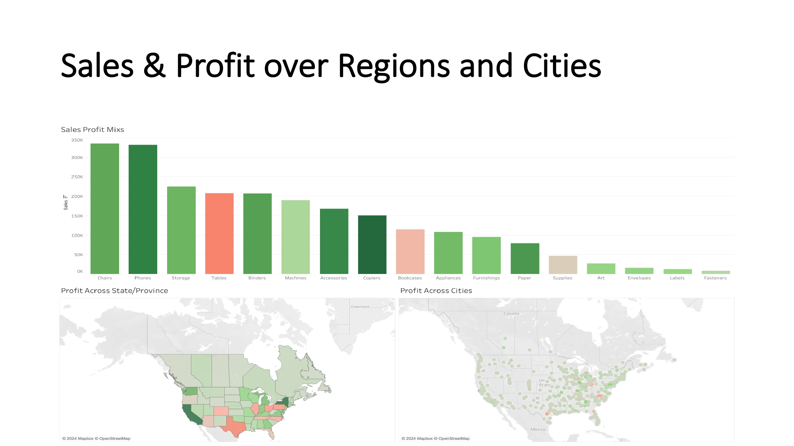

# Unlocking Profitability: Analyzing Sales and Cost Dynamics of Tables

## Overview

This project explores the performance of product categories with a specific focus on "Tables," which emerge as the 4th highest-selling product but also the highest loss-generating category. The objective is to provide actionable insights to address profitability challenges.

---

## Dataset Summary

The dataset contains company sales records, providing insights across the following dimensions:

- **Metrics**: Sales, profit, discounts, and quantity.
- **Categories**: Furniture, Office Supplies, and Technology.
- **Regions**: Central, East, South, and West.
- **Customer Segments**: Consumer, Corporate, and Home Office.

---

## Objectives

1. Identify key trends in sales and profitability.
2. Address profitability challenges, particularly for the "Tables" category.
3. Develop actionable strategies focusing on sales volume, revenue, and cost metrics.

---

## Analysis Performed

### Key Focus Areas:
- **Sales and Profit Trends**: Investigating regional and temporal patterns.
- **Discount Effects**: Evaluating the impact of discounts on profitability.
- **Geographic Insights**: Mapping profit-heavy and loss-heavy regions.
- **Segment-Specific Performance**: Analyzing consumer behavior and profitability variations.

### Findings:
1. **Negative Discount Correlation**: High discounts reduce profit margins.
2. **Segment-Specific Insights**:
   - Consumer segment shows high profit at lower discounts.
   - Corporate and Home Office segments face significant losses at high discounts.
3. **Geographic Trends**:
   - West region consistently performs well.
   - South region suffers from multiple loss-heavy categories.
4. **Profitability Decline**: Notable decline in late 2023 due to possible structural or external factors.

---

## Recommendations

### 1. Tables:
   - Reevaluate discount strategies to minimize loss.
   - Investigate and address high cost drivers (e.g., manufacturing, materials, logistics).

### 2. Discounts:
   - Limit discounts for slim-margin categories.
   - Use segment-specific discount strategies for price-sensitive customers.
   - Emulate successful strategies from profitable months (e.g., mid-2021).

### 3. Regional Strategies:
   - Focus on demand-specific strategies and operational improvements in the South region.
   - Strengthen profitability in other regions by analyzing high-performing categories like Phones, Storage, and Chairs.

---

## How to Use This Repository

1. **Data Exploration**: Analyze the dataset to understand trends and correlations.
2. **Insights Generation**: Utilize the findings to strategize profitability improvements.
3. **Visualizations**: Leverage charts and graphs to communicate insights effectively.
4. **Action Plan**: Implement recommendations to improve sales and cost efficiency.

---

## Visualizations

- **Sales & Profit**: 
- **Sales & Profit Trends**
- **Discount Effects on Profitability**: 
- **Geographic Insights**: 
- **Segment-Specific Performance**: 
